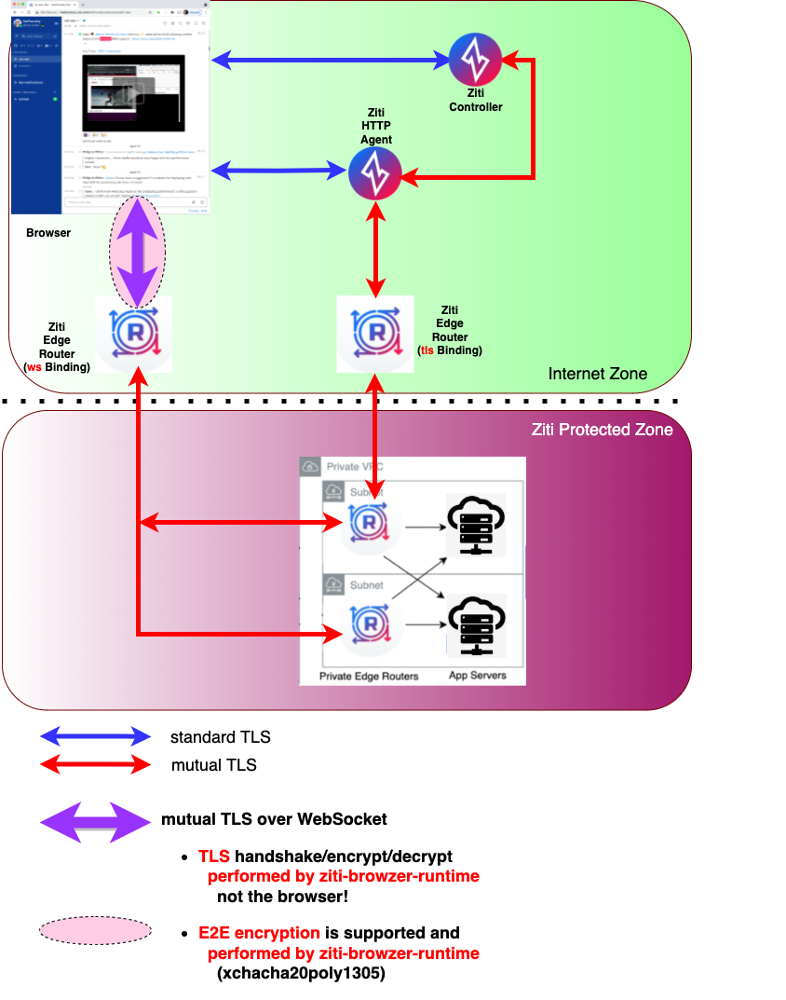

    <b>
    <a>@openziti/ziti-browzer-runtime</a>
     
     
    <b>A JavaScript runtime that is auto-injected into the Page of a <a href="https://ziti.dev/blog/zitification">Zitified</a> web app.</b>
     
     
    <b>Part of the <a href="https://ziti.devdev/about">OpenZiti</a> Zero Trust browZer stack</b>

     
    <b>Are you interested in knowing how to easily embed programmable, high performance, zero trust networking into your app, on any internet connection, without VPNs?
     
    Learn more about our <a href="https://ziti.devdev/about">OpenZiti</a> project by clicking the image below:</b>
     
     
    

---

---

 

## Overview

More detailed explanation...coming soon... but meanwhile:  

The Ziti browZer environment allows
you to run a web app server in a private, dark-to-the-internet VPC, and _still_ allow your authorized
users to access it, _AND_ you do not need to make any modifications to your web app to accomplish this.

 

